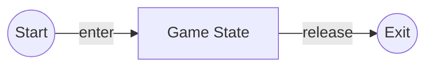

# Defining the `Game` state

Let us make a file called `game.py` inside the `src/game_states` directory. <br>
To define the main `Game` state, we need to inherit the
`BaseGameState` class.

```python
import pyved_engine as pyv


class GameState(pyv.BaseGameState):
    pass
```

The `GameState` object must define the `enter` and `exit` methods.
They are called when the game enters this state and exits
from this state respectively.

<div align="center">



</div>

```python
import pyved_engine as pyv


class GameState(pyv.BaseGameState):
    def enter(self):
        pass

    def release(self):
        pass

```

Now that we have defined the `game` state, let us do the same
for the rest of the states, i.e. `home`, `win`, and `lose`.
So, let us make the following files with the following code
in the `src/game_states` directory:

### Home `home.py`

```python
import pyved_engine as pyv


class HomeState(pyv.BaseGameState):
    def enter(self):
        pass

    def release(self):
        pass

```

### Win `win.py`

```python
import pyved_engine as pyv


class WinState(pyv.BaseGameState):
    def enter(self):
        pass

    def release(self):
        pass

```

### Lose `lose.py`

```python
import pyved_engine as pyv


class LoseState(pyv.BaseGameState):
    def enter(self):
        pass

    def release(self):
        pass

```

Now that we have defined the states, we can map them
to the actual game in the `main.py` file so that we can run them.

Let us go to `main.py` and add the following code:

```python
import pyved_engine as pyv

from globals import GameStates

from src.game_states.home import HomeState
from src.game_states.game import GameState
from src.game_states.win import WinState
from src.game_states.lose import LoseState


class Game(pyv.GameTpl):
    def get_video_mode(self):
        return pyv.HIGHRES_MODE

    def list_game_states(self):
        mapping = {
            GameStates.Home: HomeState,
            GameStates.Game: GameState,
            GameStates.Win: WinState,
            GameStates.Lose: LoseState
        }
        return GameStates, mapping


Game().loop()
```

We define a `Game` class which inherits `pyv.GameTpl`.
The `GameTpl` is an abstract class that will make handling scenes
easier for us. We are going to override the following `2` methods:

- `get_video_mode`
- `list_game_states`

The `get_video_mode` method will now return the constant
`pyv.HIGHRES_MODE`. This means the game window will render in
100% resolution of the screen.

The `list_game_states` method is used to return a mapping, i.e.
a dictionary with keys referencing the `GameStates` enums, and
the corresponding values being the respective states we defined
in the `game_states` directory.

Now, we need to define the `Game` State in details. But, before
we do that, we need to note that the current **active** state is
the `Home` state because of the order of definitions in our mapping
returned from the `list_game_states` method.

So, to set our current **active** state to the `Game` state,
we need to add the following code to the `enter` method of the
`Home` state in `home.py` file:

```python
import pyved_engine as pyv
import globals


class HomeState(pyv.BaseGameState):
    def enter(self):
        pyv.get_ev_manager().post(
            pyv.EngineEvTypes.StatePush,
            state_ident=globals.GameStates.Game
        )

    def pause(self):
        pass

    def resume(self):
        pass

    def release(self):
        pass

```

This line of code does the following:

- get the `EventManager` instance using the `pyv.get_ev_manager` function
- call the `post` method on the `EventManager` instance and pass the `pyv.EngineEvTypes.StatePush` event
- pass the additional key-value pair `state_ident` : `globals.GameStates.Game` as keyword argument in the function

Therefore, as the `Home` state **enters** the state machine, it will immediately **push** the
`Game` state on top of the stack.

## Further Defining the `Game` state

As `pyved_engine` is an `ECS` based engine, everything in the engine is going 
to be a `Component` object. The `Component` objects can **_post_** other `events` to the system (`Emitter`),
or both **_post_** and **_listen_** to events (`EventListener`).

Every frame, we need to refresh the screen with a color or a background.
So let us write a `Background` component which will fill the screen
with a color per frame.

Let us make a file named `background.py` in `src/game_objects` and 
add the following code:
```python
import pyved_engine as pyv


class BackgroundColor(pyv.EvListener):
    def __init__(self, color):
        super().__init__()
        self.color = color

    def on_paint(self, ev):
        ev.screen.fill(self.color)

```

A couple of things to note here:

We defined a `BackgroundColor` class which inherits the `pyv.EvListener`
class. This means this class can **_post_** as well as **_listen_** to events.

Then we passed a color value to the `__init__` method. This color
will be the color that is used to fill the screen per frame.

Then, we defined the `on_paint` event. Remember to have the exact
signature of the method. The `ev` argument passed to the method is
the event object that triggered this method. We can get the `screen`
object using the `ev.screen` attribute.<br>
Then we fill the screen using the color value we passed.

Let us now instantiate this object and add it as a component to
the `GameState` class.

Go over to `src/game_states/game.py` and modify it using the following code:

```python
import pyved_engine as pyv

from src.game_objects.background import ColorBackground


class GameState(pyv.BaseGameState):
    def __init__(self, ident):
        super().__init__(ident)
        self.components = [
            ColorBackground(color="#36354A")
        ]

    def enter(self):
        for i in self.components:
            i.turn_on()

    def release(self):
        for i in self.components:
            i.turn_off()
```

In the `__init__` method, we have created a list of components.
And in the `enter` method, we turn on the components, i.e. *activate*
them. We turn them off in the `release` method.

