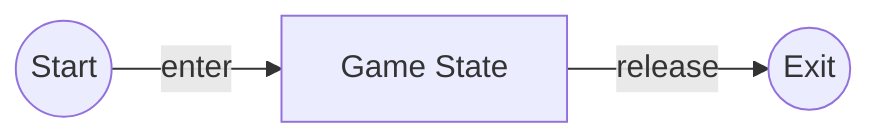

# Defining the `Game` state

Let us make a file called `game.py` inside the `src/game_states` directory. <br>
To define the main `Game` state, we need to inherit the
`BaseGameState` class.

```python
import pyved_engine as pyv

class GameState(pyv.BaseGameState):
    pass
```

The `GameState` object must define the `enter` and `exit` methods.
They are called when the game enters this state and exits
from this state respectively.

<div align="center">



</div>

```python
import pyved_engine as pyv

class GameState(pyv.BaseGameState):
    def enter(self):
        pass

    def release(self):
        pass

```