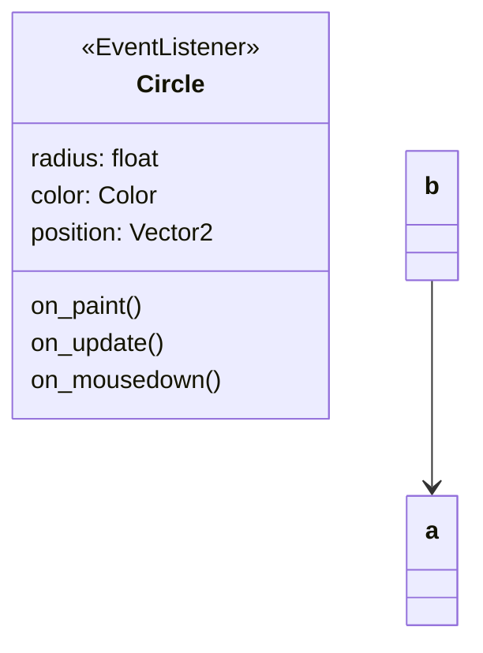

# Defining the `Game` state

As `pyved_engine` uses the `ECS` structure, everything in the engine is going
to be a `Component` object. The `Component` objects can **_post_** other `events` to the system (`Emitter`),
or both **_post_** and **_listen_** to events (`EventListener`).

Every frame, we need to refresh the screen with a color or a background.
So let us write a `Background` component which will fill the screen
with a color per frame.

Let us make a file named `background.py` in `src/game_objects` and
add the following code:

```python
import pyved_engine as pyv


class BackgroundColor(pyv.EvListener):
    def __init__(self, color):
        super().__init__()
        self.color = color

    def on_paint(self, ev):
        ev.screen.fill(self.color)

```

A couple of things to note here:

We defined a `BackgroundColor` class which inherits the `pyv.EvListener`
class. This means this class can **_post_** as well as **_listen_** to events.

Then we passed a color value to the `__init__` method. This color
will be the color that is used to fill the screen per frame.

Then, we defined the `on_paint` event. Remember to have the exact
signature of the method. The `ev` argument passed to the method is
the event object that triggered this method. We can get the `screen`
object using the `ev.screen` attribute.<br>
Then we fill the screen using the color value we passed.

Let us now instantiate this object and add it as a component to
the `GameState` class.

Go over to `src/game_states/game.py` and modify it using the following code:

```python
import pyved_engine as pyv

from src.game_objects.background import ColorBackground


class GameState(pyv.BaseGameState):
    def __init__(self, ident):
        super().__init__(ident)
        self.components = [
            ColorBackground(color="#36354A")
        ]

    def enter(self):
        for i in self.components:
            i.turn_on()

    def release(self):
        for i in self.components:
            i.turn_off()
```

In the `__init__` method, we have created a list of components.
And in the `enter` method, we turn on the components, i.e. *activate*
them. We turn them off in the `release` method.

Let us now define the `Circle` object - the clickable object
that we will clck to get points in the game.<br>
Before writing the code, let us draw a flowchart for the behavior.

<div align="center">
<table width="100%">
<tr>
<th>class Circle</th>
<th>flowchart</th>
</tr>
<tr>
<td>



</td>
</tr>
</table>


</div>

