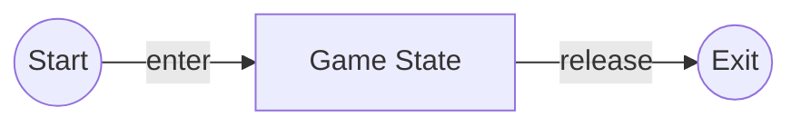

# Defining the `Game` state

Let us make a file called `game.py` inside the `src/game_states` directory. <br>
To define the main `Game` state, we need to inherit the
`BaseGameState` class.

```python
import pyved_engine as pyv

class GameState(pyv.BaseGameState):
    pass
```

The `GameState` object must define the `enter` and `exit` methods.
They are called when the game enters this state and exits
from this state respectively.

<div align="center">



</div>

```python
import pyved_engine as pyv

class GameState(pyv.BaseGameState):
    def enter(self):
        pass

    def release(self):
        pass

```

Now that we have defined the `game` state, let us do the same
for the rest of the states, i.e. `home`, `win`, and `lose`.
So, let us make the following files with the following code
in the `src/game_states` directory:

### Home `home.py`
```python
import pyved_engine as pyv


class HomeState(pyv.BaseGameState):
    def enter(self):
        pass

    def release(self):
        pass

```

### Win `win.py`
```python
import pyved_engine as pyv


class WinState(pyv.BaseGameState):
    def enter(self):
        pass

    def release(self):
        pass

```

### Lose `lose.py`
```python
import pyved_engine as pyv


class LoseState(pyv.BaseGameState):
    def enter(self):
        pass

    def release(self):
        pass

```

Now that we have defined the states, we can map them
to the actual game in the `main.py` file so that we can run them.

Let us go to `main.py` and add the following code:

```python
import pyved_engine as pyv

from globals import GameStates

from src.game_states.home import HomeState
from src.game_states.game import GameState
from src.game_states.win import WinState
from src.game_states.lose import LoseState


class Game(pyv.GameTpl):
    def get_video_mode(self):
        return pyv.HIGHRES_MODE

    def list_game_states(self):
        mapping = {
            GameStates.Home: HomeState,
            GameStates.Game: GameState,
            GameStates.Win: WinState,
            GameStates.Lose: LoseState
        }
        return GameStates, mapping


Game().loop()
```
