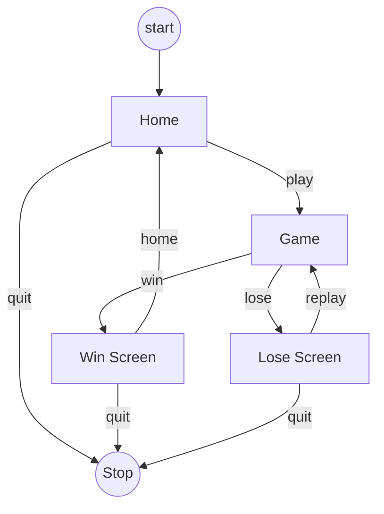

# Structure of the Game

Before proceeding to programming the game, we need to decide its structure.
There will be many `scenes` or `states` of the game.

color = #36354A

Flowchart for the structure

