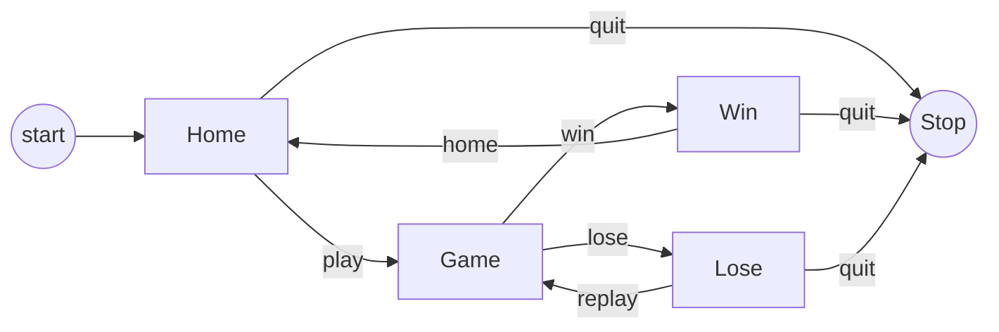
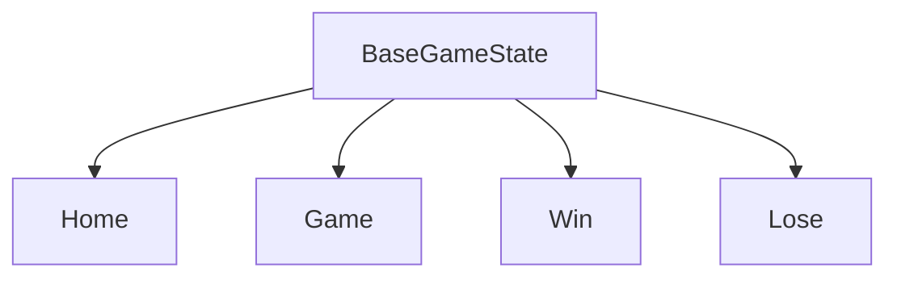
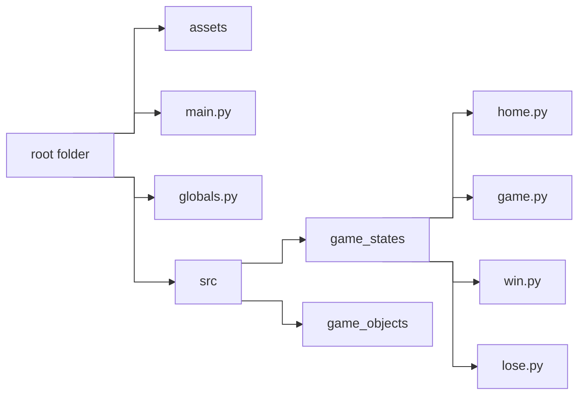

# Structure of the Game

To ensure a well-organized game, it is essential to determine its structure in advance.

This entails an initial
**_Home_** Screen serving as a gateway to other crucial sections like the **_Game_** screen. These sections, referred
to as **scenes** (or `states` within the engine), offer a modular framework for streamlined flow and efficient
management.

color = #36354A

The game first starts with the `home` state, where the player selects they want to play the game or quit.
Based on the input, the new state can be either the `game` or `stop` state.

Similarly, the entire structure of the game can be outlined by the following flowchart:

<div align="center">



*flowchart for the game structure*
</div>

`pyved_engine` provides game templates so that designing all these states and managing them using a state machine
becomes
easier for us. Let's see how to do that.

## The game states

From the flowchart, we can notice that there are `4` game states:

- `Home`: The start state
- `Game`: The game state
- `Win`: The Win state when the player wins the game
- `Lose`: The Lose state when the player loses the game

Each of these states must take some input, and process them, and transition to another state based on the scenario
`pyved_engine` provides a base game state called `BaseGameState` so that we can simply inherit it
and ensure the same generic behaviors among all the states instead of rewriting them from scratch.

<div align="center">



</div>

## The directory Structure

Writing all the class definitions in one file is going to make it harder to navigate each
section. This is why we are going to make a separate file for each class.

Let us make this folder structure in the root folder of your game:

<div align="center">



</div>

The `main.py` will be the entry point to our game. Running the `main.py` should run
the entire game.<br>
The `globals.py` is for defining global states and custom events for the game.

With this setup, we can now begin programming the states.
But before that, let us open the `globals.py` file and add the following code:

```python
import pyved_engine as pyv

GameStates = pyv.struct.enum(
    'Home',
    'Game',
    'Win',
    'Lose',
)
```

This code will define the enums `Home`, `Game`,
`Win` and `Lose`. This will help us map these names to
their respective Game States later. So, we can just reference
these states as `GameStates.Home`, `GameStates.Game`, etc.

Since we already defined the `globals.py`, let us complete writing all definitions
and declarations.
Add the following code:

```python
GameEvents = pyv.game_events_enum((
    'ScoreUpdate',
))


class SharedVars:
    SCORE = 0
    HIGH_SCORE = 0

```

The `GameEvents` variable is used to define the various custom events we can use in-game.
For now, we have added the `ScoreUpdate` event to the list. This will be used
later in the game to update the score based on the user's clicks.

Along with that, we have the `SharedVars` class which will be used for storing the
current Score and High Score. This acts like a singleton for global variables.


