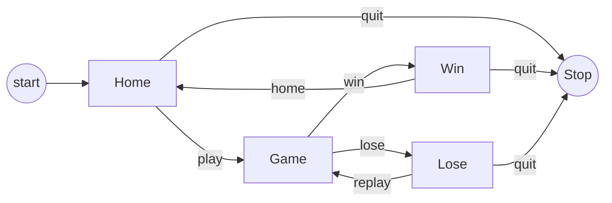
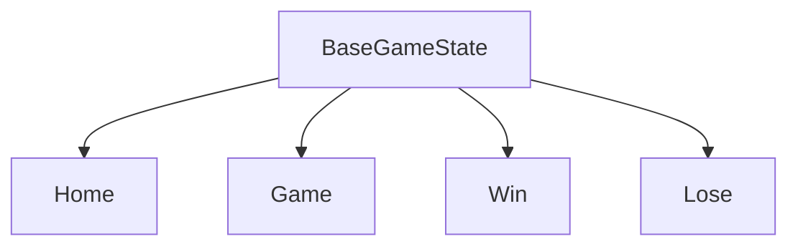
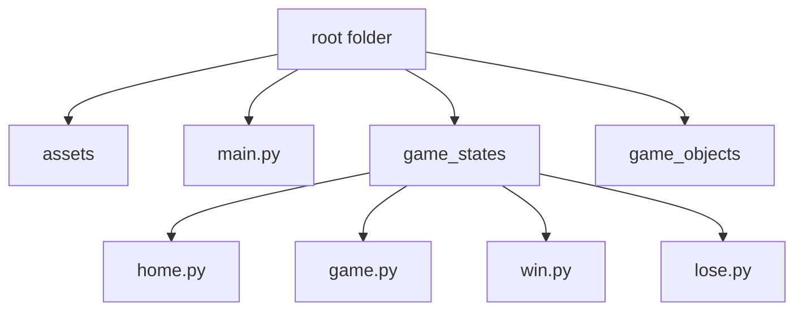

# Structure of the Game

To ensure a well-organized game, it is essential to determine its structure in advance.

This entails an initial
**_Home_** Screen serving as a gateway to other crucial sections like the **_Game_** screen. These sections, referred
to as **scenes** (or `states` within the engine), offer a modular framework for streamlined flow and efficient
management.

color = #36354A

The game first starts with the `home` state, where the player selects they want to play the game or quit.
Based on the input, the new state can be either the `game` or `stop` state.

Similarly, the entire structure of the game can be outlined by the following flowchart:

*flowchart for the game structure*

`pyved_engine` provides game templates so that designing all these states and managing them using a state machine
becomes
easier for us. Let's see how to do that.

## The game states

From the flowchart, we can notice that there are `4` game states:

- `Home`: The start state
- `Game`: The game state
- `Win`: The Win state when the player wins the game
- `Lose`: The Lose state when the player loses the game

Each of these states must take some input, and process them, and transition to another state based on the scenario
`pyved_engine` provides a base game state called `BaseGameState` so that we can simply inherit it
and ensure the same generic behaviors among all the states instead of rewriting them from scratch.

## The directory Structure

Writing all the class definitions in one file is going to make it harder to navigate each
section. This is why we are going to make a separate file for each class

