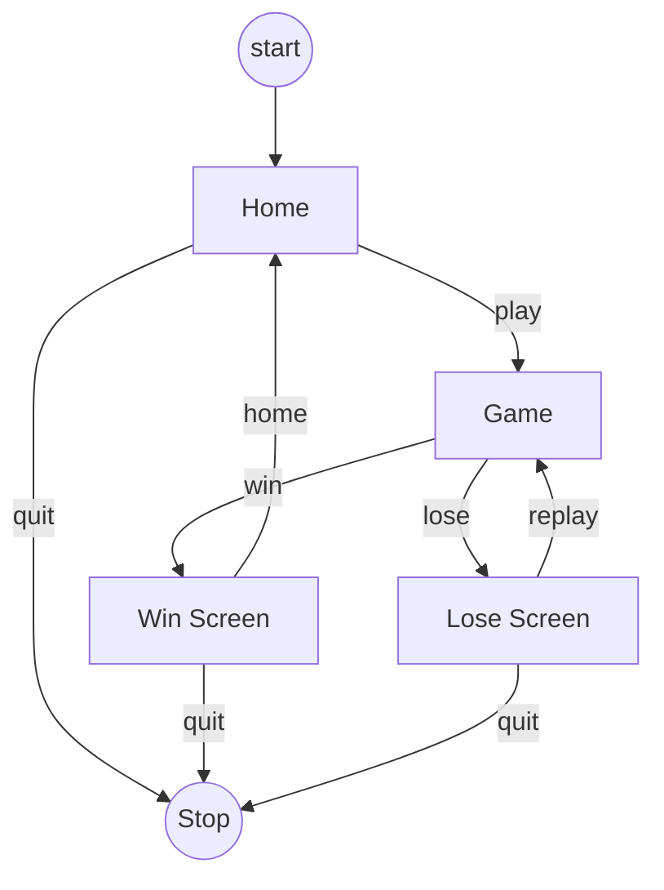

# Structure of the Game

To ensure a well-organized game, it is essential to determine its structure in advance. 

This entails an initial 
**_Home_** Screen serving as a gateway to other crucial sections like the **_Game_** screen. These sections, referred
to as "scenes" (or `states` within the engine), offer a modular framework for streamlined flow and efficient management.

color = #36354A

Flowchart for the structure

The 
